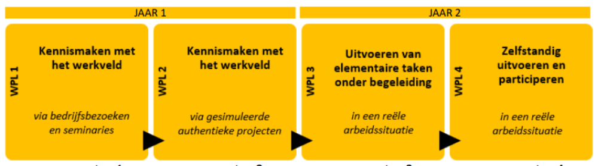
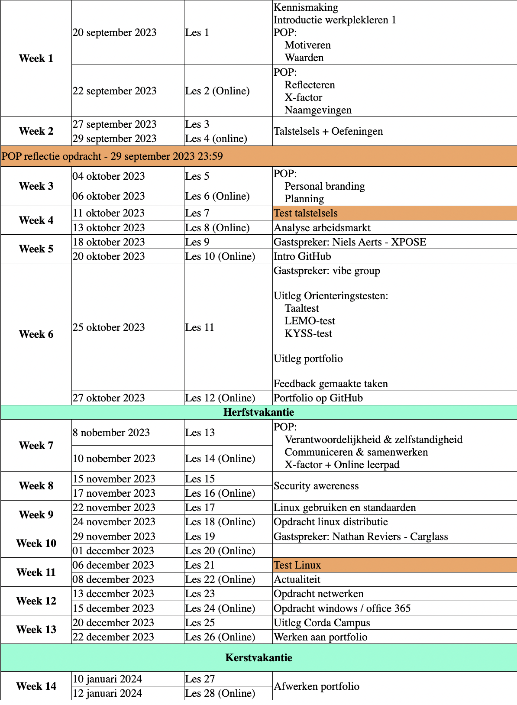

# Logboek werkplekleren

## Logboek WPL 1
**Werkplekleren is een belangrijk onderdeel in de studie van Graduaat Systemen en Netwerken.**

**Het doel van WPL1 was oriëntering en kennismaken met het werkveld.**

Hiervoor hebben we opdrachten gedaan om het werkveld te verkenning, stilgestaan bij persoonlijke
kwaliteiten en ontwikkeling, gastcolleges gevolgd en kleine technische opdrachten uitgevoerd.

### **Planning WPL1:**

## Logboek WPL 2
Zie [Opdrachten](./Opdrachten/Opdrachten.md) en [Reflectie](./Reflectie/Reflectie.md)
## Logboek WPL 3
Tijdens het voorbije semester WPL3 Heb ik veel bijgeleerd hoe het in de werkwereld aan toe gaat. Ik heb mijn theoretische kennis niet alleen kunnen toepassen maar ook mijn kennis kunnen verdiepen. ik heb aan belangrijke vaardigheden zoals communicatie, samenwerking en zelfstandigheid kunnen werken. In het begin was het wennen aan werken in een team maar gaandeweg voelde ik mij zekerder worden en durfde ik al meer mijn mening geven. Ik heb doorheen WPL3 niet alleen geleerd van mijn fouten maar ook geleerd om efficiënter te werken. Feedback van mijn begeleider hielp mij om gerichter te werken en mijn sterke en zwakke punten beter te herkennen. Over het algemeen kijk ik positief terug op dit semester en kijk ik al uit naar WPL4. 
[WPL3-Logboek_KaddourAbdelghani](https://drive.google.com/file/d/1GXQdwKa9Pu5mJYZe5nY2gBNNtdkkwahh/view?usp=sharing)
## Logboek WPL4
Tijdens WPL4 heb ik geleerd om veel zelfstandiger te werken en verantwoordelijkheid op te nemen voor mijn eigen taken. Ik heb zowel mijn technische kennis als mijn soft skills verder kunnen toepassen en ontwikkelen in een professionele omgeving. De samenwerking binnen het team verliep steeds vlotter, en naarmate mijn stage vorderde werd ik vaker betrokken bij het zoeken naar oplossingen voor problemen en het ondersteunen van collega's. De verschillende uitdagingen die ik tijdens mijn stage tegenkwam, hebben mij veel bijgeleerd en zorgden ervoor dat ik mezelf bleef ontwikkelen. De feedback van mijn werkplekcoach was hierbij zeer waardevol, omdat die mij hielp om mijn sterke punten te herkennen en inzicht te krijgen in de aspecten waaraan ik nog kon werken. Ik ben trots op wat ik tijdens deze periode heb bereikt en kijk met een positief gevoel terug op mijn prestaties. De kennis, vaardigheden en ervaringen die ik tijdens WPL4 heb opgedaan, zullen zonder twijfel een belangrijke meerwaarde zijn voor mijn verdere professionele carrière.
[WPL4-Logboek_KaddourAbdelghani](https://drive.google.com/file/d/1wEcO2tPULQ0TImFmgzWwUwmdKhOU42lJ/view?usp=sharing) 
